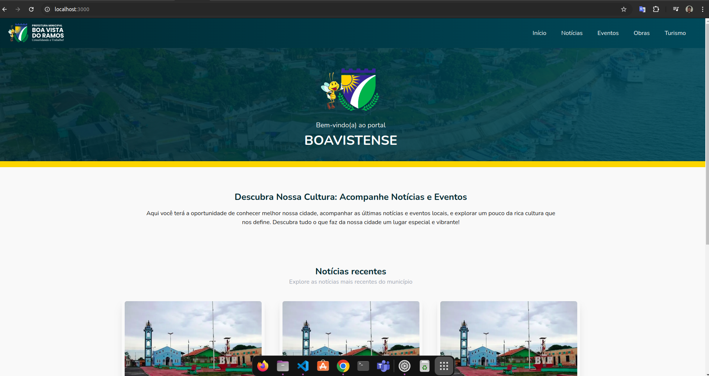

## BLOG BVR



Este projeto é um blog dedicado à cidade de Boa Vista do Ramos, no interior do Amazonas, com o objetivo de promover a cultura local, fornecer informações sobre eventos, notícias, obras e turismo. A plataforma visa divulgar as tradições e atividades da cidade, promover a transparência na gestão pública e manter a população e visitantes bem informados sobre o que acontece em Boa Vista do Ramos.

Tecnologias Utilizadas:
    Next.js
    Tailwind CSS
    TypeScript
    Node.js

[Template Figma](https://www.figma.com/design/UIopZjBgoQ3olvyDIXfJo4/pf?node-id=0-1&t=AVpKXYyhqyYJLBxz-0)

Comandos para executar a aplicação:

```bash
npm run dev
# or
yarn dev
# or
pnpm dev
# or
bun dev
```